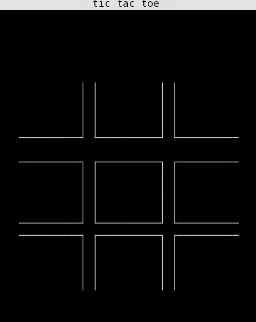

# TicTacToe-Game
A tictactoe game with curses in python. 3x3 game
## Install
### using pip
```
pip install git+https://github.com/sayampy/TicTacToe-Game.git
```
### manually
```
$ git clone https://github.com/sayampy/TicTacToe-Game/

$ cd TicTacToe-Game
$ python setup.py install
```
## How to play
<kbd>1</kbd> to <kbd>9</kbd> keys for place a move
<br><kbd>q</kbd> to exit
## Demo
[](https://github.com/sayampy/TicTacToe-Game/)
